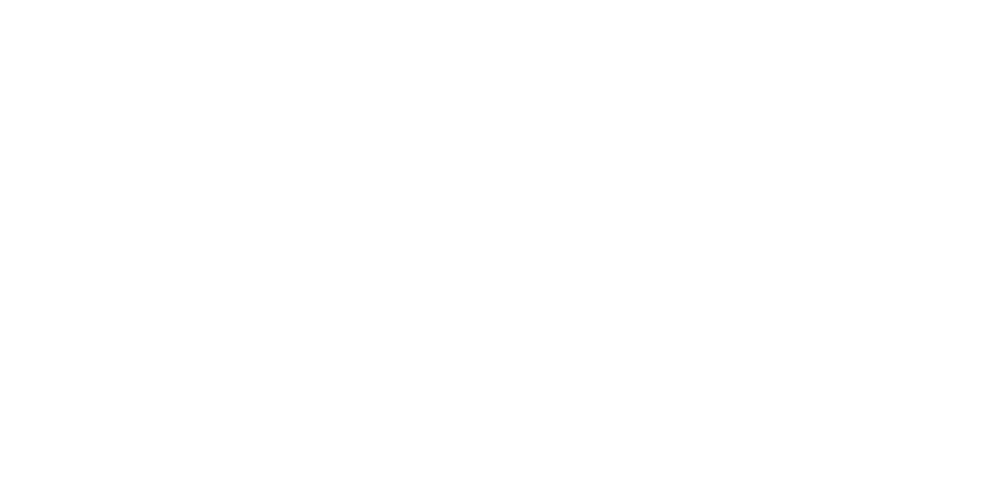

  

## Bio
- 🏫 Graduated at **University of San Carlos, Cebu, PH**
- 💬 Able to speak in English, Filipino, and Bisaya
- 📱 Interested in frontend development
- 🎯 Aiming to learn more JS Frameworks

## Used Technologies
&nbsp;
&nbsp;
&nbsp;
&nbsp;

&nbsp;
&nbsp;
&nbsp;
&nbsp;
&nbsp;
&nbsp;
&nbsp;
&nbsp;
&nbsp;
&nbsp;

## Contact Me
 &nbsp;

<!--
**nichoblina/nichoblina** is a ✨ _special_ ✨ repository because its `README.md` (this file) appears on your GitHub profile.

Here are some ideas to get you started:

- 🔭 I’m currently working on ...
- 🌱 I’m currently learning ...
- 👯 I’m looking to collaborate on ...
- 🤔 I’m looking for help with ...
- 💬 Ask me about ...
- 📫 How to reach me: ...
- 😄 Pronouns: ...
- ⚡ Fun fact: ...
-->
